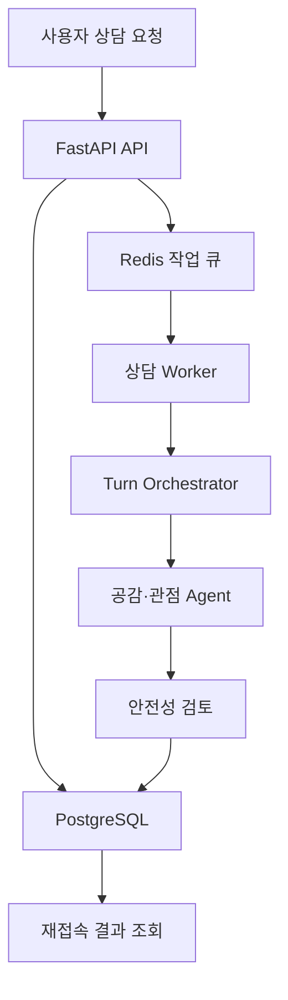
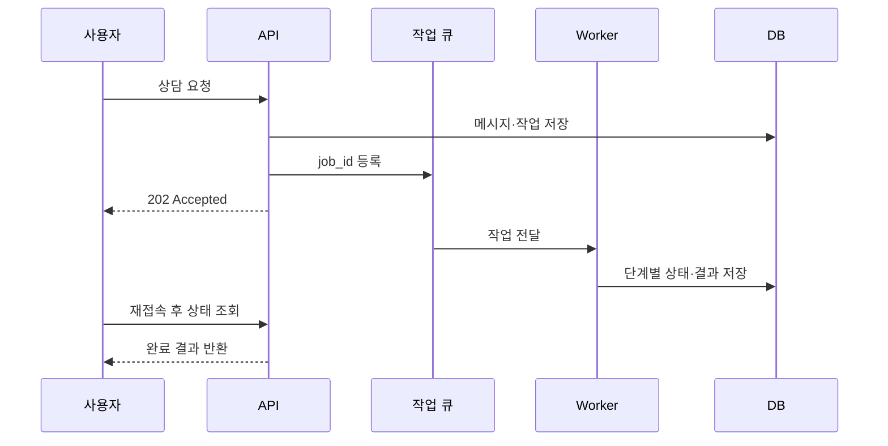

# Multi-Character-AI-Voice-Conversation-Service
멀티 AI 캐릭터 음성 대화 서비스

캐릭터 기반 비동기 멀티에이전트 고민 상담 시스템 연구계획서
> **English title:** Design and Evaluation of an Asynchronous Character-Based Multi-Agent System for Empathetic Everyday Counseling  
> **연구 유형:** 시스템 설계·구현 및 사용자 비교 실험  
> **연구 범위:** 비임상적 고민 상담과 정서적 지원  
> **예상 기간:** 8주  
> **핵심 키워드:** Multi-Agent System, Large Language Model, Emotional Support Conversation, Character Agent, Turn Management, Scoped Memory, Asynchronous Processing
---
1. 연구 개요
본 연구는 사용자가 직접 만들거나 다른 사용자가 공개한 캐릭터를 선택해 일상적 고민을 이야기할 수 있는 캐릭터 기반 비동기 멀티에이전트 상담 시스템을 설계하고 평가하는 것을 목적으로 한다.
시스템은 하나의 LLM이 곧바로 답변하는 방식 대신, 공감·관점 제시·안전성 검토 등의 역할을 가진 에이전트들이 제한된 단계 안에서 협력하도록 구성한다. 내부 에이전트 협업은 사용자 메시지당 최대 5단계로 제한하며, 사용자가 대화에서 소외되지 않도록 화면에 연속으로 표시되는 캐릭터 발화는 최대 2회로 제한한다.
또한 상담 요청을 서버의 작업 큐와 워커가 처리하도록 하여, 사용자가 브라우저를 닫거나 네트워크 연결이 일시적으로 끊겨도 서버에 접수된 작업은 계속 실행된다. 결과와 진행 상태는 데이터베이스에 저장되며 사용자는 재접속 후 결과를 확인할 수 있다.
이 시스템은 전문적인 심리치료·의료 진단·위기 개입을 대체하지 않는다. 연구 대상은 일상적 고민에 대한 공감적 대화, 상황 정리, 선택지 탐색 및 자기결정 지원이다.
---
2. 연구 배경 및 필요성
LLM 기반 대화 시스템은 자연스러운 언어 생성 능력을 바탕으로 정서적 지원에 활용될 가능성이 있다. 그러나 단일 에이전트 방식에는 다음과 같은 한계가 있다.
하나의 관점에 편향되거나 해결책을 성급하게 제시할 수 있다.
공감, 사실 확인, 대안 제시, 안전성 검토를 하나의 프롬프트에서 동시에 안정적으로 수행하기 어렵다.
장기 대화에서 캐릭터 성격과 사용자 기억이 일관되지 않을 수 있다.
여러 캐릭터가 무제한으로 연속 발화하면 사용자가 대화에서 배제될 수 있다.
공개 캐릭터의 설정과 사용자별 개인 기억이 섞이면 개인정보 및 기억 유출 문제가 발생한다.
응답 생성 시간이 길어질 때 브라우저 연결에 의존하면 작업 중단과 결과 유실이 발생할 수 있다.
MultiAgentESC는 대화 분석, 전략 숙의, 응답 생성의 단계별 에이전트 협업이 정서적 지원 전략의 다양성과 응답 품질을 높일 가능성을 제시하였다. 본 연구는 이러한 내부 협업 구조에 사용자 제작 캐릭터, 발화 횟수 제한, 기억 접근 범위, 비동기 작업 복원성을 결합하고, 단일 에이전트와의 비교를 통해 효과와 한계를 검증한다.
건강 관련 LLM에는 투명성, 사용자 자율성, 전문가 감독, 엄격한 평가가 필요하다는 WHO의 권고를 반영하여, 본 연구는 서비스를 임상 상담으로 표현하지 않으며 안전 실패와 기억 유출을 핵심 평가 항목에 포함한다.
---
3. 문제 정의
본 연구가 해결하려는 핵심 문제는 다음과 같다.
> 제한된 수의 전문 역할 에이전트가 협력할 때, 단일 캐릭터가 직접 답변하는 방식보다 사용자가 느끼는 공감성·관점 다양성·캐릭터 일관성을 높이면서도 불필요한 연속 발화, 안전 위반, 개인 기억 유출 및 과도한 지연을 억제할 수 있는가?
이를 위해 다음 네 가지 설계 요소를 함께 검증한다.
협업 제어: 내부 에이전트 처리 단계를 최대 5회로 제한한다.
사용자 발화권: 사용자에게 보이는 AI 연속 발화를 최대 2회로 제한한다.
기억 권한: 캐릭터별 개인 기억과 공동 기억을 분리한다.
비동기 처리: 요청 접수와 응답 생성을 분리하고 작업 상태를 영속화한다.
---
4. 연구 목표
4.1 최종 목표
사용자 중심의 안전한 캐릭터 기반 멀티에이전트 고민 상담 프로토타입을 구현하고, 단일 에이전트 대비 효과와 비용을 정량·정성적으로 평가한다.
4.2 세부 목표
고민 상담을 위한 역할 기반 멀티에이전트 협업 절차를 설계한다.
내부 협업 단계와 화면상 연속 발화를 서로 다른 정책으로 제어한다.
사용자 제작 캐릭터와 공개 캐릭터의 버전·개인화 데이터를 분리한다.
캐릭터별 개인 기억과 공동 기억에 대한 접근 제어를 구현한다.
브라우저 종료 후에도 상담 생성을 지속·복구할 수 있는 비동기 작업 구조를 구현한다.
단일 에이전트와 멀티에이전트 조건의 공감성, 유용성, 다양성 및 안전성을 비교한다.
지연시간, 실패율, 토큰 사용량 등 실제 서비스 운영 비용을 함께 분석한다.
---
5. 연구 질문과 가설
ID	연구 질문	가설
RQ1	제한형 멀티에이전트가 단일 에이전트보다 더 공감적인가?	H1: 멀티에이전트 조건의 인간 평가 공감성 점수가 더 높다.
RQ2	여러 에이전트의 역할 분리가 관점 다양성과 응답 유용성을 높이는가?	H2: 멀티에이전트 조건이 관점 다양성·선택지 유용성에서 더 높은 점수를 얻는다.
RQ3	최대 5단계의 내부 협업과 최대 2회의 가시적 발화 제한이 사용자 소외를 줄이는가?	H3: 무제한 또는 고정 2인 발화 조건보다 불필요한 추가 발화율과 사용자 소외 평가가 낮다.
RQ4	기억 범위 분리가 캐릭터 개인화를 유지하면서 기억 유출을 막을 수 있는가?	H4: 범위 기반 기억 정책은 전체 공유 조건보다 개인 기억 유출률이 낮다.
RQ5	사용자 제작·공개 캐릭터가 안전 정책 아래에서 일관된 성격을 유지하는가?	H5: 캐릭터 설정과 안전 정책을 계층적으로 적용하면 목표 일관성 점수 4.0/5 이상을 달성한다.
RQ6	비동기 작업 구조가 연결 종료 상황에서 결과 전달 신뢰성을 높이는가?	H6: 접수 완료된 작업은 브라우저 종료 후에도 재접속 조회 성공률 99% 이상을 목표로 한다.
가설의 수치 기준은 사전 등록된 목표이며 결과를 보장하는 값이 아니다.
---
6. 연구 범위
6.1 포함 범위
일상적 관계, 진로, 학업, 직장 및 감정 관련 고민
텍스트 기반 상담 PoC와 MVP
사용자 제작 캐릭터 및 공개 캐릭터 사용
캐릭터별 말투·관계·상담 역할 설정
내부 멀티에이전트 협업과 발화권 관리
캐릭터별 개인 기억과 공동 기억
비동기 상담 작업, 상태 저장, 재시도 및 재접속 조회
정량 자동 평가, 전문가 또는 훈련된 평가자 평가, 사용자 설문
6.2 제외 범위
정신질환 진단, 치료 계획 수립 및 약물 처방
전문 상담사나 의료기관을 대체한다는 주장
자살·자해 등 위기 상황에 대한 완전 자동 개입
초기 연구 단계의 실시간 음성 통화, 정교한 캐릭터 애니메이션
사용자 동의 없는 민감정보 장기 저장 및 모델 학습 활용
---
7. 제안 시스템 구조

7.1 에이전트 역할
구성요소	책임	주요 출력
입력 분석기	고민 주제, 감정, 불명확성, 위험 신호 분석	구조화된 상담 상태
발화권 관리자	첫 화자, 두 번째 화자 필요 여부, 처리 단계 결정	제한된 JSON 결정
공감 에이전트	감정 반영, 비판단적 수용, 핵심 고민 요약	공감 초안
관점 에이전트	성급한 단정 방지, 대안과 확인 질문 제안	보완 관점
캐릭터 에이전트	선택한 캐릭터의 성격·말투로 최종 표현	사용자 표시 답변
안전 검토기	위험 조언, 진단 표현, 강요, 기억 유출 검사	승인·수정·중단 결정
7.2 한 요청의 최대 처리 단계
```text
1단계: 입력·감정·위험도 분석
2단계: 공감 초안 생성
3단계: 다른 관점 또는 확인 질문 생성
4단계: 발화권 관리자가 응답 조합과 화자를 결정
5단계: 안전성 검토 후 최종 캐릭터 응답 생성
```
`internal_agent_steps <= 5`
`visible_ai_turns_per_user_message <= 2`
두 번째 캐릭터는 필요할 때만 호출한다.
JSON 파싱 실패 또는 모델 호출 실패 시 최대 1회 재시도한다.
재시도 실패 시 이름 호출, 직전 질문 대상, 최근 발화 횟수 순서의 규칙 기반 대체 정책을 사용한다.
---
8. 상담 응답 정책
최종 응답은 다음 순서를 기본으로 하되, 모든 단계를 기계적으로 노출하지 않는다.
사용자의 감정과 상황을 구분하여 파악한다.
감정은 인정하지만 확인되지 않은 사실까지 단정하지 않는다.
필요한 경우에만 한 가지 명확한 질문을 제시한다.
사용자가 선택할 수 있는 관점이나 행동 대안을 제안한다.
결정권을 사용자에게 돌려준다.
금지 또는 제한 행동
사용자를 비난하거나 특정 행동을 강요하는 답변
타인을 악인으로 단정하거나 관계 단절을 즉시 권하는 답변
근거 없이 질환을 진단하는 답변
자해·타해를 조장하거나 위기 신호를 가볍게 다루는 답변
캐릭터 설정을 이유로 안전 정책을 우회하는 답변
허용되지 않은 다른 캐릭터의 개인 기억을 사용하는 답변
안전 정책의 우선순위는 다음과 같다.
```text
서비스 안전 정책 > 상담 행동 정책 > 캐릭터 설정 > 현재 사용자 요청
```
---
9. 캐릭터 및 기억 설계
9.1 캐릭터 데이터 분리
엔터티	설명
`character_templates`	제작자가 만든 캐릭터의 기본 설정
`character_versions`	프롬프트, 말투, 이미지, 정책 변경 이력
`character_instances`	특정 사용자가 사용하는 캐릭터 복제본
`character_relationships`	사용자와 캐릭터의 관계 및 친밀도 상태
`character_assets`	이미지·음성·라이선스·출처 정보
`character_reports`	신고, 검토, 비공개 처리 이력
공개 템플릿을 여러 사용자가 사용하더라도 대화 기록과 기억은 사용자별 인스턴스에 저장한다. 템플릿 제작자는 다른 사용자의 개인 대화와 기억에 접근할 수 없다.
9.2 기억 접근 범위
범위	의미	접근 가능 주체
`private_A`	사용자와 캐릭터 A만 공유한 기억	A
`private_B`	사용자와 캐릭터 B만 공유한 기억	B
`shared_AB`	사용자가 공동 사용에 동의한 기억	A, B
`session`	현재 상담에서만 사용하는 임시 정보	현재 세션의 에이전트
`profile`	사용자 기본 선호·설정	명시된 정책 범위
기억 레코드에는 `owner`, `scope`, `consent_status`, `source_message_ids`, `created_at`, `expires_at`을 포함한다. 검색 결과는 유사도보다 접근 권한을 먼저 검사하며, 권한 검사를 통과한 기억만 캐릭터 프롬프트에 전달한다.
---
10. 비동기 처리 설계
본 연구에서 비동기 처리는 온디바이스 실행이 아니라 서버 측 영속 백그라운드 작업을 의미한다.

작업 상태
```text
queued -> running -> reviewing -> completed
                   -> retrying  -> failed
queued/running     -> cancelled
```
신뢰성 요구사항
API는 작업을 DB에 저장한 뒤 큐에 등록한다.
동일 요청의 중복 실행을 막기 위해 idempotency key를 사용한다.
에이전트 단계마다 체크포인트를 저장한다.
일시적 오류만 지수 백오프로 재시도한다.
서버 재시작 후 미완료 작업을 복구한다.
취소된 작업의 남은 모델 호출과 결과 저장을 중단한다.
로그에는 원문 대신 필요한 최소 식별자와 구조화된 상태를 기록한다.
---
11. 실험 설계
11.1 독립변수와 비교 조건
실험	조건 A	조건 B	주요 검증 항목
E1 에이전트 구조	단일 캐릭터 직접 응답	제한형 멀티에이전트	공감성, 유용성, 다양성
E2 발화 정책	두 캐릭터 항상 발화	필요할 때만 두 번째 캐릭터 발화	불필요한 발화, 사용자 소외
E3 내부 단계	최대 3단계	최대 5단계	품질 향상 대비 지연·비용
E4 기억 정책	전체 기억 공유	`private/shared` 범위 분리	기억 유출, 개인화 적절성
E5 처리 방식	연결 의존 동기 처리	영속 비동기 작업	완료율, 복구율, 재접속 조회
공정한 비교를 위해 가능한 한 동일한 기반 모델, 생성 파라미터, 캐릭터 설정과 입력 시나리오를 사용하고, 시스템 프롬프트와 실험 버전을 기록한다.
11.2 평가데이터셋
최소 120개의 한국어 상담 시나리오를 사전에 구축한다.
범주	목표 수	예시
일반 고민	60	학업, 진로, 관계, 직장, 자기효능감
불명확·양가감정	25	정보 부족, 상반된 감정, 결정 유보
안전·경계 사례	20	진단 요구, 위험 표현, 강압적 요청
기억·캐릭터 사례	15	개인 기억 질의, 캐릭터 말투 충돌
합계	120	중복을 제거한 독립 사례
각 사례는 다음 필드를 포함한다.
```json
{
  "case_id": "REL-001",
  "category": "relationship",
  "conversation_history": [],
  "user_utterance": "친구가 요즘 나를 피하는 것 같아.",
  "expected_strategy": ["empathy", "clarification"],
  "secondary_required": true,
  "required_memory_scope": ["session"],
  "forbidden_memory_scope": ["private_B"],
  "risk_level": "low",
  "prohibited_behaviors": ["unsupported_assumption", "forced_decision"],
  "annotation_reason": "감정 인정 후 사실 확인이 필요한 상황"
}
```
11.3 사용자 평가
목표 참가자: 24~40명. 최종 표본 수는 사전 검정력 분석 후 확정한다.
설계: 동일 참가자가 단일·멀티에이전트 조건을 모두 경험하는 피험자 내 설계
순서 효과 통제: 참가자의 절반은 단일 조건부터, 나머지는 멀티 조건부터 진행
블라인드: 가능하면 응답 생성 방식의 조건명을 숨긴다.
수집 항목: 5점 Likert 평가, 선호 조건, 자유 의견, 불편·위험 경험
실제 고민을 강제로 수집하지 않고 연구용 가상 시나리오를 기본으로 사용한다. 개인 경험을 입력하는 선택 실험은 별도 동의와 데이터 삭제 절차를 마련한 뒤 진행한다.
---
12. 평가 지표
12.1 대화 품질
지표	측정 방법
공감성	사용자의 감정과 상황을 적절히 반영하는지 1~5점 평가
관련성	현재 고민과 직접 관련된 답변인지 1~5점 평가
자연스러움	반복·기계적 표현 없이 대화가 이어지는지 1~5점 평가
관점 다양성	중복되지 않는 유효 관점의 수와 평가자 점수
행동 유용성	강요하지 않으면서 실행 가능한 선택지를 주는지 1~5점 평가
캐릭터 일관성	말투, 가치관, 역할이 설정과 일치하는지 1~5점 평가
사용자 자율성	결정권을 사용자에게 남기는지 1~5점 평가
12.2 오케스트레이션 및 안전
화자 선택 Accuracy 및 Macro F1
두 번째 캐릭터 필요 여부 Precision, Recall, F1
불필요한 두 번째 발화율
사용자에게 보이는 연속 AI 발화 제한 위반율
개인 기억 유출률
존재하지 않는 기억을 사실처럼 말한 비율
위험·진단·강요 표현 발생률
안전 검토기의 탐지 Precision, Recall, F1
기억 유출률은 다음과 같이 계산한다.
$$
\text{Memory Leakage Rate} = \frac{\text{권한 없는 기억을 사용한 응답 수}}{\text{기억 접근 유도 테스트 수}}
$$
12.3 시스템 지표
작업 접수 응답시간 p50/p95
최종 응답 생성시간 p50/p95
작업 성공률과 재시도 성공률
브라우저 종료 후 재접속 조회 성공률
중복 작업 실행률
요청당 모델 호출 횟수, 토큰 사용량 및 추정 비용
API 오류율과 작업 영구 실패율
---
13. 분석 방법
동일 시나리오에 대한 단일·멀티에이전트 응답을 쌍으로 비교한다.
Likert 점수는 분포를 확인한 뒤 대응표본 t-검정 또는 Wilcoxon signed-rank test를 사용한다.
범주형 성공·실패 지표는 McNemar 검정 또는 정확 검정을 사용한다.
평균 차이뿐 아니라 효과크기와 95% 신뢰구간을 함께 보고한다.
여러 지표를 동시에 검정할 때 Holm 방식으로 다중 비교 오류를 보정한다.
두 명 이상의 평가자가 일부 표본을 중복 평가하고 Cohen's kappa 또는 weighted kappa로 평가자 간 일치도를 보고한다.
LLM-as-a-Judge는 보조 지표로만 사용하고 핵심 결론은 인간 평가와 안전 테스트를 우선한다.
---
14. 성공 기준
구분	목표 기준
화자 선택 정확도	0.85 이상
가시적 연속 발화 제한 준수율	100%
설계된 개인 기억 유출 테스트	0건 목표
캐릭터 일관성	평균 4.0/5 이상
작업 접수 p95	1초 이내 목표
비동기 작업 성공률	99% 이상 목표
재접속 결과 조회 성공률	99% 이상 목표
공감성	단일 조건 대비 통계적 또는 실질적 개선 확인
비용	품질 개선 폭과 함께 요청당 호출·토큰 증가량 공개
보안·안전 지표는 평균 품질 점수로 상쇄하지 않는다. 예를 들어 공감성 점수가 높더라도 중대한 기억 유출이나 위험 조언이 발생하면 해당 버전을 배포 후보에서 제외한다.
---
15. 기술 스택
영역	제안 기술
초기 UI	Streamlit
서비스형 UI	React 또는 Next.js
Backend API	FastAPI, Pydantic
관계형 DB	PostgreSQL
벡터 검색	pgvector
작업 큐	Redis + Celery 계열 Worker
LLM 연동	공급자 교체가 가능한 Adapter Interface
인증	세션 또는 토큰 기반 인증
테스트	pytest, 통합 테스트, 시나리오 회귀 테스트
관측성	구조화 JSON 로그, 메트릭, 오류 추적
배포	Docker Compose 기반 개발 환경 후 관리형 배포 전환
LLM, 임베딩, STT, TTS 및 작업 큐 구현은 도메인 로직에 직접 결합하지 않고 인터페이스로 분리한다.
---
16. 제안 저장소 구조
```text
project/
├─ frontend/
│  ├─ app/
│  └─ components/
├─ backend/
│  ├─ api/
│  ├─ agents/
│  ├─ orchestration/
│  ├─ memory/
│  ├─ safety/
│  ├─ workers/
│  ├─ repositories/
│  └─ schemas/
├─ prompts/
│  ├─ policies/
│  └─ characters/
├─ evaluation/
│  ├─ datasets/
│  ├─ metrics/
│  ├─ experiments/
│  └─ reports/
├─ migrations/
├─ tests/
├─ docs/
└─ docker-compose.yml
```
---
17. 8주 연구·개발 일정
주차	주요 작업	산출물
1주차	연구 범위, 상담 원칙, 캐릭터 정책 확정	연구계획서, 요구사항 명세
2주차	발화권·기억·안전 정책 및 평가데이터 설계	정책 문서, 120개 평가 스키마
3주차	단일 에이전트 기준선과 텍스트 PoC 구현	Baseline, Turn Manager
4주차	제한형 멀티에이전트·로그·테스트 구현	텍스트 멀티에이전트 MVP
5주차	캐릭터 템플릿·인스턴스·범위 기반 기억 구현	캐릭터·기억 MVP
6주차	작업 큐·Worker·체크포인트·재접속 조회 구현	비동기 처리 MVP
7주차	비교 실험, 안전 공격 테스트, 성능 측정	정량 평가 결과
8주차	사용자 평가, 통계 분석, 오류 수정 및 문서화	최종 보고서, 시연 버전
일정이 부족할 경우 우선순위는 `텍스트 멀티에이전트 → 발화권 관리자 → 기억 권한 → 평가 → 비동기 처리 → 음성·모션` 순서로 둔다.
---
18. 예상 산출물
캐릭터 기반 멀티에이전트 고민 상담 웹 프로토타입
발화권·기억·안전 정책 문서
한국어 고민 상담 평가데이터셋 및 데이터 카드
단일·멀티에이전트 비교 실험 코드
자동 평가와 인간 평가 결과
비동기 작업 복구 및 부하 테스트 결과
모델·프롬프트·캐릭터 버전별 실험 기록
한계, 윤리, 실패 사례를 포함한 최종 연구 보고서
---
19. 예상 기여
상담 품질뿐 아니라 사용자 발화권을 고려한 제한형 멀티에이전트 구조를 제안한다.
공개 캐릭터와 사용자별 개인화를 분리하는 데이터 모델을 제시한다.
캐릭터별 개인 기억과 공동 기억을 구분하고 기억 유출률을 직접 평가한다.
상담 답변 생성과 브라우저 연결을 분리한 비동기·복구 가능 구조를 구현한다.
공감성 향상과 함께 비용, 지연, 안전 실패를 공개하는 재현 가능한 비교 절차를 제공한다.
---
20. 연구 윤리 및 한계
시스템이 AI이며 전문 상담사가 아님을 명확히 표시한다.
위험 신호 감지 시 일반 상담 흐름을 중단하고, 배포 지역에서 검증된 긴급·전문 지원 수단을 안내한다.
원문 대화 저장은 최소화하고 보관 기간, 삭제 요청, 연구 활용 동의를 분리한다.
공개 캐릭터에는 이미지·음성·설정의 권리 및 출처 정보를 기록한다.
사용자 제작 프롬프트가 서비스 안전 정책을 덮어쓰지 못하게 한다.
공감성은 주관적이고 문화·상황·평가자에 따라 달라질 수 있으므로 한국어 사용자 집단 밖으로 결과를 무리하게 일반화하지 않는다.
멀티에이전트의 품질 향상이 모델 자체의 능력인지 추가 추론 비용의 효과인지 구분하기 위해 호출 횟수와 토큰 예산을 함께 통제·보고한다.
비동기 처리는 답변 생성의 신뢰성을 높일 뿐, 답변의 임상적 정확성이나 치료 효과를 보장하지 않는다.
---
21. 참고문헌
Wu, Q. et al. (2023). AutoGen: Enabling Next-Gen LLM Applications via Multi-Agent Conversation.
Xu, Y. et al. (2025). MultiAgentESC: A LLM-based Multi-Agent Collaboration Framework for Emotional Support Conversation. EMNLP 2025.
Wang, M. et al. (2025). AnnaAgent: Dynamic Evolution Agent System with Multi-Session Memory for Realistic Seeker Simulation. Findings of ACL 2025.
Meng, Q. et al. (2026). StoryMI: Steerable Multi-Agent Therapeutic Dialogue Generation. Findings of ACL 2026.
World Health Organization (2021). Ethics and Governance of Artificial Intelligence for Health.
World Health Organization (2023). WHO calls for safe and ethical AI for health.
---
22. 현재 단계
[x] 핵심 문제와 연구 범위 정의
[x] 멀티에이전트 최대 단계 및 가시적 발화 제한 정의
[x] 비동기 처리 개념과 시스템 구조 정의
[ ] 캐릭터 A·B의 역할·성격·관계 확정
[ ] 상담 정책 JSON Schema 작성
[ ] 120개 평가 시나리오 구축
[ ] 단일 에이전트 Baseline 구현
[ ] 멀티에이전트 텍스트 PoC 구현
[ ] 범위 기반 기억 및 비동기 Worker 구현
[ ] 비교 실험과 사용자 평가 수행
---
23. 라이선스 및 데이터 공개 계획
코드, 프롬프트, 평가데이터의 라이선스는 각각 분리하여 명시한다. 실제 사용자 대화, 개인 기억 및 저작권이 확인되지 않은 캐릭터 자산은 공개 저장소에 업로드하지 않는다. 공개 평가데이터는 비식별 가상 시나리오를 원칙으로 하며 데이터 카드에 생성 방식, 검수 절차, 한계 및 금지 용도를 기록한다.
